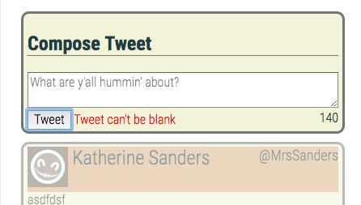

# Tweeter Project

Tweeter is a simple, single-page Twitter clone.

Users are provided a display of historical tweets that have been made via testing.  The compose button will allow them to create a new tweet of 140 characters or less.  It will then display immediately via ajax & mongoDB.  The app will add a time stamp, a name and avatar to simulate a random user with each tweet.

## Dependencies

  - body-parser": "^1.18.3",
  - chance": "^1.0.16",
  - express": "^4.16.4",
  - md5": "^2.2.1",
  - mongodb": "^2.2.36"

## File Structure

Homescreen:

Screenshot when user provides no text in text area:

Screenshot when user provides text > 140 char:

Screenshot after user presses compose:

